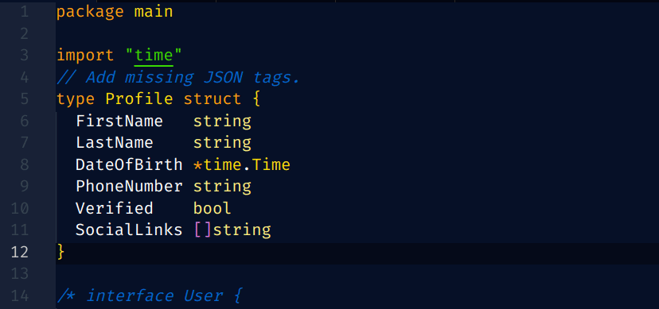
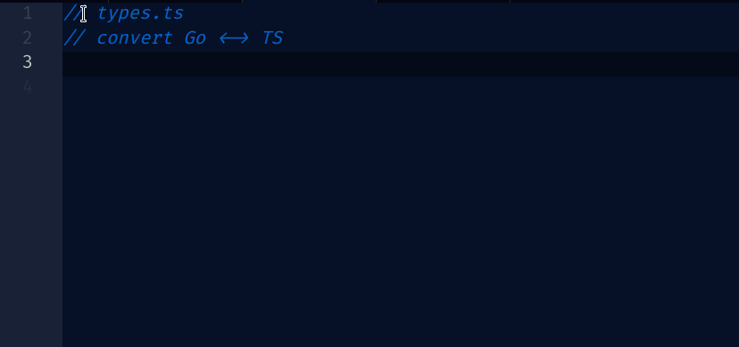

# go4lagetool

A VSCode extension for converting Go structs to TypeScript interfaces and vice versa. 
Helpful for simple JSON API design.

Also check [go4lage.com](https://go4lage.com/).

## Features

1. Adds JSON tags if missing in Go structs.
2. Convert Go structs to TypeScript interfaces.
3. Convert TypeScript interfaces to Go structs.

- Context menu integration for quick access
- Configurable context menu visibility
- Handles basic Go types and common struct tags
- Supports optional fields (`omitempty`)

## Demo

### AUTO JSON TAGS (If not present)

### GO <-> TS

## Installation

1. Install the extension from the VSCode Marketplace (available soon)
2. Reload VSCode

Or Download here:
(https://workupload.com/file/TUcAcRxAyzq)[https://workupload.com/file/TUcAcRxAyzq]

## Usage

1. Select a Go struct or TypeScript interface in your editor
2. Right-click and choose "Convert Struct ↔ Interface (Go ↔ TS)" from the context menu
3. The converted code will replace the selected text

### Commands

- `go4lagetool.convert`: Convert Go struct ↔ TypeScript interface

## Configuration

- `go4lagetool.showContextMenu`: Show/hide the convert option in the editor context menu (default: true)

## Supported Types

### Go to TypeScript

| Go Type | TypeScript Type |
|---------|-----------------|
| `string` | `string` |
| `int`, `int8`, `int16`, `int32`, `int64`, `uint`, `uint8`, `uint16`, `uint32`, `uint64`, `float32`, `float64` | `number` |
| `bool` | `boolean` |
| `time.Time` | `string` |
| `[]T` | `T[]` |
| `*T` | `T` |

### TypeScript to Go

| TypeScript Type | Go Type |
|-----------------|---------|
| `string` | `string` |
| `number` | `int` |
| `boolean` | `bool` |
| `T[]` | `[]T` |

## License

MIT License - see the [LICENSE](LICENSE) file for details.